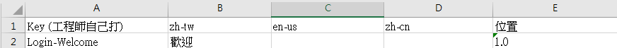

# Multi-Language-Xaml.Generator
本專案可以幫助**WPF**開發者從**Excel**快速產生多國語言的xaml文件

## 使用方法
```
-i, --input        Required. 紀錄多國語言的 Excel

-k, --Key          Required. 在 Excel 中多國語言的主鍵欄位

-l, --Language     Required. 在 Excel 中多國語言的語言資料欄位

-o, --output       Xaml 輸出路徑

--help             Display this help screen.

--version          Display version information.
```
以下圖為例

### Windows
```
.\Multi-Language-Xaml.Generator.exe -i "C:\Users\User\多國語言.xlsx" -k "Key (工程師自己打)" -l zh-tw en-us
```
### Linux & Mac OS
```
./Multi-Language-Xaml.Generator -i "~\多國語言.xlsx" -k "Key (工程師自己打)" -l zh-tw en-us
```
